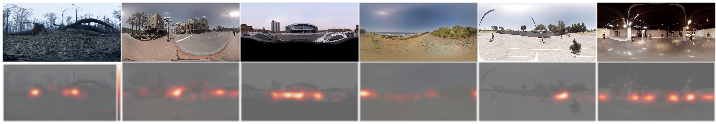

In this repository, we are sharing our developed test-bed and captured user data that we hope will enable in creating more immersive virtual reality experiences. This repository is for open source codes and materials for the QoMEX 2018 paper: Visual Attention in *omnidirectional video (ODV)* for *virtual reality (VR)* Applications

### Abstract
Understanding of visual attention is crucial for ODV viewed for instance with a head-mounted display (HMD), where only a fraction of an ODV is rendered at a time. Transmission and rendering of ODV can be optimized by understanding how viewers consume a given ODV in VR applications. In order to predict video regions that might draw the attention of viewers, *saliency maps* can be estimated by using computational visual attention models. As no such model currently exists for ODV, but given the importance for emerging ODV applications, we create a new visual attention user dataset for ODV, investigate behavior of viewers when consuming the content, and analyze the prediction performance of state-of-the-art visual attention models. Our developed test-bed and dataset will be publicly available with this paper, to stimulate and support research on ODV.

### Test-bed


### Results


### Downloads
[DataSet](https://github.com/cozcinar/omniAttention/blob/master/dataset.tar.gz)

*News* you can use clustering code (ParsingStats_DBSCAN.ipynb) in order to generate visual attention per frame.
For this, you would need to run jupyter notebook.

### Citation

|  | Paper accepted in [10th International Conference on Quality of Multimedia Experience (QoMEX 2018) ](https://www.qomex2018.org/) |

Please cite our [paper](https://github.com/cozcinar/omniAttention/blob/master/OmniAttention2018.pdf) in your publications if it helps your research:
````
@inproceedings{Ozcinar2018,
title = {Visual Attention in Omnidirectional Video for Virtual Reality Applications},
author = {Cagri Ozcinar and Aljosa Smolic},
year = {2018},
date = {2018-05-29},
booktitle = {10th International Conference on Quality of Multimedia Experience (QoMEX 2018)}
}
````

### Authors

| [Cagri Ozcinar][CagriOzcinar-web] | [Aljosa Smolic][AljosaSmolic-web] |

[CagriOzcinar-web]: (https://www.scss.tcd.ie/~ozcinarc/)

[AljosaSmolic-web]: (https://v-sense.scss.tcd.ie/?profile=prof-aljosa-smolic-2)

### Acknowledgement

This publication has emanated from research conducted with the financial support of Science Foundation Ireland (SFI) under the Grant Number *15/RP/2776*. We gratefully acknowledge the support of NVIDIA Corporation for the donation of GPUs used in this work.

### Contact

If you have any question, send an e-mail at [ozcinarc@scss.tcd.ie]()
